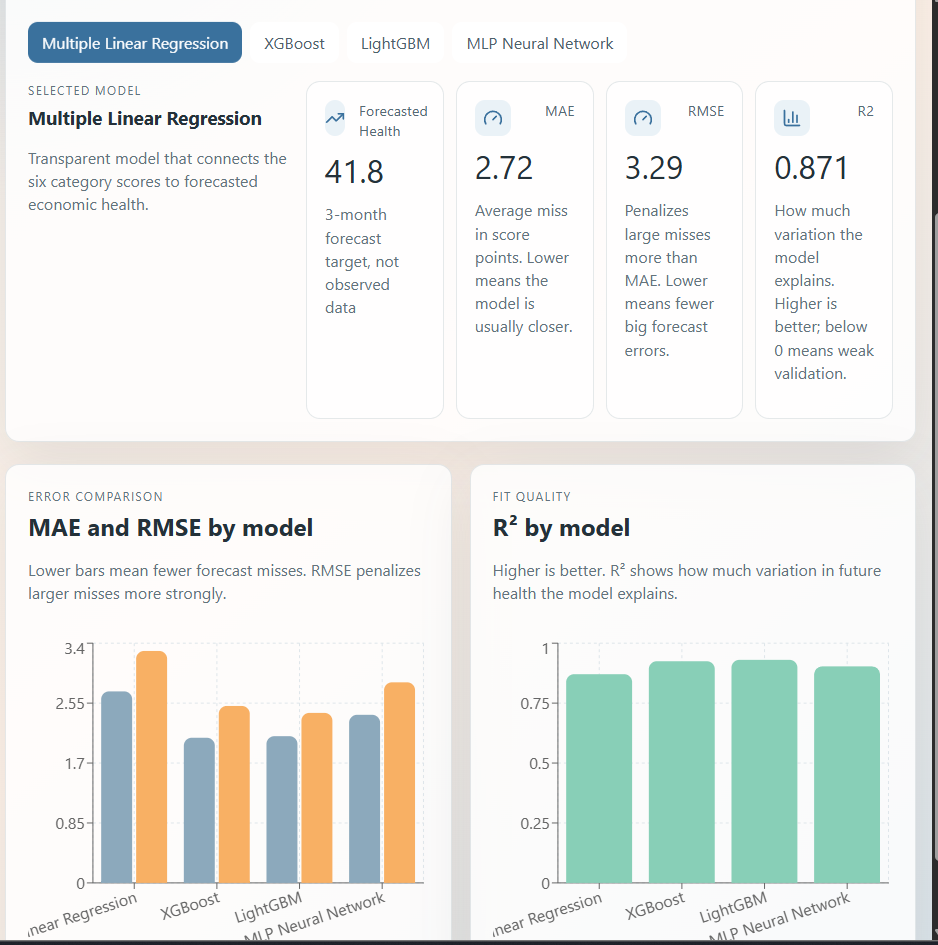
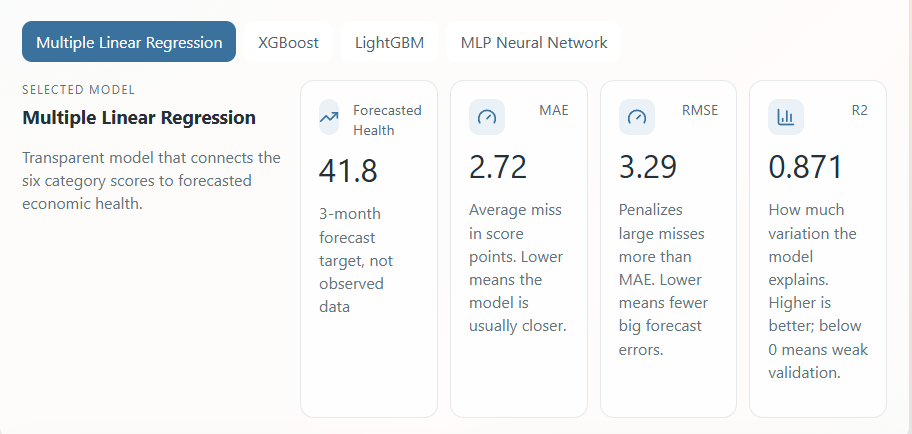
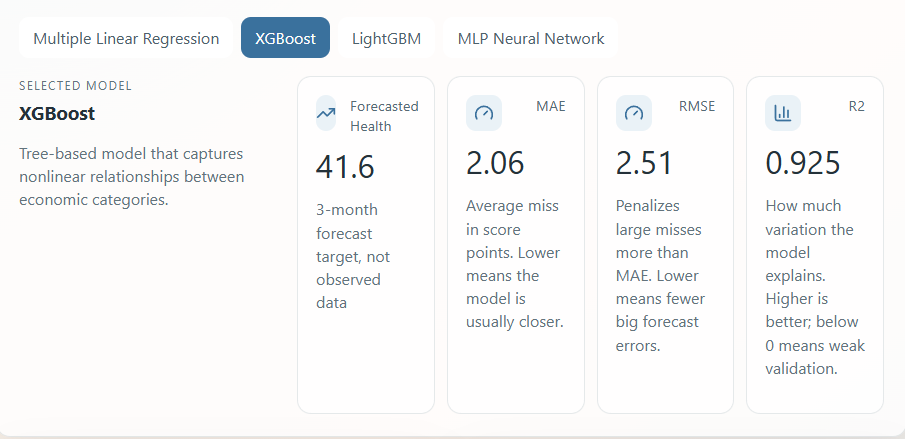
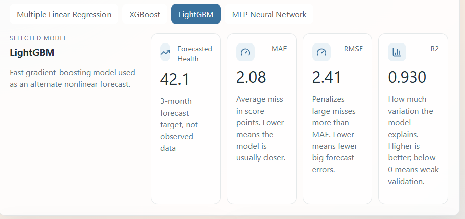
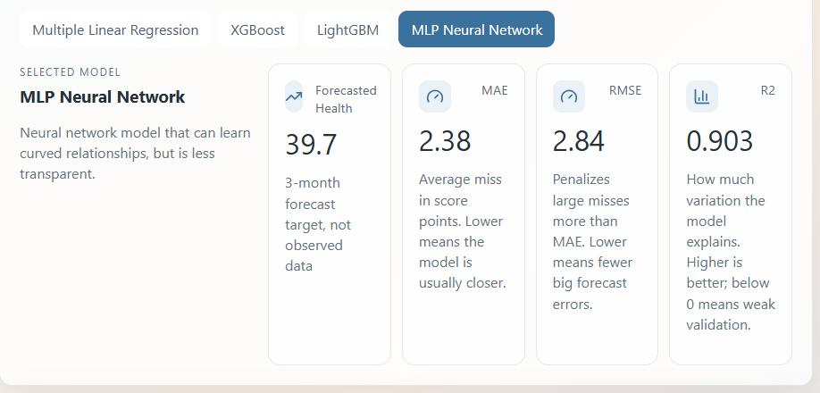

# EconPulse

**Live Demo:** [econ-pulse-9cuc.vercel.app](https://econ-pulse-9cuc.vercel.app/)

A student-centered economic dashboard that converts public FRED macroeconomic data into practical financial awareness tools for students, young adults, and early investors.

Built for HackDavis 2026, EconPulse combines data pipelines, machine learning models, scenario simulation, and an interactive frontend to make economic conditions easier to interpret.

## Project overview

Economic indicators are often scattered across government dashboards, dense reports, and disconnected datasets. EconPulse brings these indicators into one interface and translates them into a more intuitive view of economic health.

The project focuses on questions like:

- Is the labor market strengthening or weakening?
- Is inflation pressure rising or cooling?
- How do different indicators combine into an overall economic health score?
- How do model predictions change under different economic scenarios?

## Screenshots

### Model Hub



### Model Cards









## Key features

- Economic dashboard using FRED-style macro indicators
- Processed data pipeline with cached/mock fallback support
- Model Hub comparing Linear Regression, Ridge Regression, and XGBoost
- Scenario simulator for changing category assumptions
- Interactive frontend built with React, TypeScript, Vite, and Recharts
- Backend pipeline using Python, pandas, NumPy, and scikit-learn

## Tech stack

**Frontend**
- React
- TypeScript
- Vite
- Recharts
- lucide-react
- CSS

**Backend**
- Python
- pandas
- NumPy
- scikit-learn
- Optional XGBoost

**Data**
- FRED API when available
- Cached or mock data fallback
- Processed JSON files served to the frontend

## Repository structure

```text
EconPulse/
├── backend/
├── data/
├── frontend/
│   └── public/data/
└── README.md
```

## Run the backend

```bash
python -m backend.run_pipeline
```

The backend writes processed files to `data/processed` and syncs frontend-ready outputs into:

```text
frontend/public/data
```

## Run the frontend

```bash
cd frontend
npm install
npm run dev
```

## Dashboard sections

| Section | Purpose |
|---|---|
| Dashboard | Displays current economic health and category-level scores |
| Model Hub | Compares model forecasts and validation metrics |
| What-If Simulator | Tests scenario changes with slider-based inputs |
| Documentation | Explains pipeline, stack, and data files |

## Modeling approach

The model hub forecasts overall economic health three months ahead. The project compares multiple supervised learning models so users can see how different model assumptions affect predictions.

Current model comparison includes:

- Linear Regression
- Ridge Regression
- XGBoost, when available

## Model Performance

The Model Hub compares several supervised learning models for a 3-month economic health forecast.

| Model | Forecasted Health | MAE | RMSE | R² |
|---|---:|---:|---:|---:|
| Multiple Linear Regression | 41.8 | 2.72 | 3.29 | 0.871 |
| XGBoost | 41.6 | 2.06 | 2.51 | 0.925 |
| LightGBM | 42.1 | 2.08 | 2.41 | 0.930 |
| MLP Neural Network | 39.7 | 2.38 | 2.84 | 0.903 |

Lower MAE and RMSE indicate smaller forecast errors. Higher R² indicates that the model explains more variation in the future economic health target.

LightGBM performed best overall, with the lowest RMSE and highest R² among the tested models. XGBoost had the lowest MAE, making both gradient-boosting models stronger than the linear and neural-network baselines.

## What I learned

This project helped me connect economics, statistics, and software engineering in one system. I practiced building an end-to-end data product, from data ingestion and preprocessing to modeling, frontend design, and deployment.

## Planned improvements

- Add more economic indicators and metadata
- Improve model validation and backtesting
- Add time-series models
- Add confidence intervals or uncertainty bands
- Improve responsive design
- Add richer documentation for each indicator
- Add automated tests for backend data transformations

## Disclaimer

EconPulse is an educational project and is not financial advice.

## Candidate signal

EconPulse reflects my interest in quantitative finance, macroeconomic data, and applied machine learning. I built this project to show that I can work across data pipelines, statistical modeling, and frontend product design.
